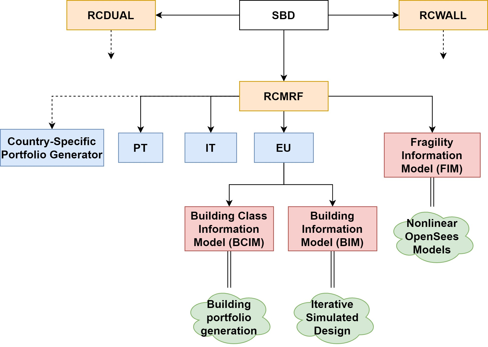

# simulated-design
Alpha-version. It is the same as the original MATLAB version of the code used for deriving RC frame building fragility curves of ESHM2020, however, it does not include infill modelling.
Alpha-version of the simulated-design software tool. This is the first python version of the original simulated-design MATLAB code. It has been revised and several mistakes has been fixed. It still relies on use of arrays, hence, it is not fully object-oriented. It is much faster than the original code, however, it is not well-commented. Moreover, it does not allow easy custom geometry implementations. This version cannot be easily used for community-based development.

 
