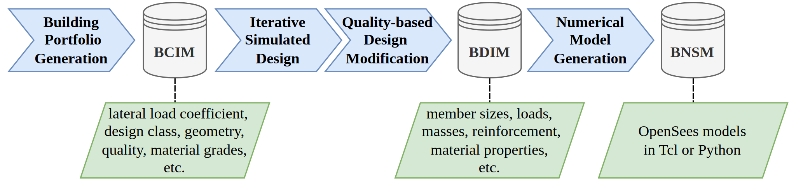

# Built Environmenta Data (BED) - SimDesign Framework
A Python package for the modeling the seismic vulnerability of buildings using the simulated design. Currently, it focuses on Reinforced Concrete (RC) Moment Resisting Frames (MRFs), but the workflow is adaptable to other structural systems. To ensure modularity and scalability for future extensions, the **rcmrf** framework is integrated within the broader **simdesign** library. The framework can accommodate the design of buildings using both historical and modern seismic design procedures and regulations, while capturing building-to-building variability. It generates Building Class Information Models (BCIM), Building Design Information Models (BDIM), and Building Nonlinear Structural Models (BNSM) that are analyzable in OpenSees.



## Installation

Follow the steps below to install the `simdesign` package:

### 1. Clone the Repository
   Open your terminal and run:
   ```bash
   git clone https://github.com/builtenvdata/simulated-design.git
   cd simulated-design
   ```

### 2. Set Up a Virtual Environment (Recommended)
   Create a virtual environment to manage dependencies:
   ```bash
   python -m venv .venv  # On Windows
   python3 -m venv .venv  # On Linux
   ```
   Activate the virtual environment:
   ```bash
   .venv\Scripts\activate  # On Windows
   source .venv/Scripts/activate  # On Linux
   ```

### 3. Install Dependencies
   Install the required packages listed in `requirements.txt`.

   **For Windows Users:** Install the appropriate requirements file based on your Python version:
   ```bash
   pip install -r requirements-py311-win64.txt  # Python 3.11
   pip install -r requirements-py312-win64.txt  # Python 3.12
   ```
   **For Linux Users:** Install the appropriate requirements file based on your Python version:
   ```bash
   pip install -r requirements-py311-linux64.txt  # Python 3.11
   pip install -r requirements-py312-linux64.txt  # Python 3.12
   ```
   **For macOS Users:** OpenSeesPy is currently incompatible with macOS versions running on arm64 processors (e.g., M1 and M2 chips). Consequently, newer versions of OpenSeesPy are not released for the macOS platforms. It is recommended to use a virtual machine running Linux or Windows on Mac computers to utilize OpenSeesPy.

### 4. Install the Package
   Install the `simdesign` package:
   ```bash
   pip install .
   ```

   Alternatively, to install in editable mode (useful for development), run:
   ```bash
   pip install -e .
   ```

## Usage

Once installed, you can import and use the package in Python:

```python
# Example usage
from simdesign import rcmrf

# The main inputs for each design class
inputs = {
    'bcim': {
        'design_class': 'eu_cdl',
        'sample_size': 30,
        'num_storeys': 4,
        'beta': 0.1,
        'seed': 2
    },
    'bnsm': {
        "scheme": 'FMP',
        "dincr": 1e-4,
        'max_drift': 0.1,
        'opensees': 'py'
    }
}

# Run the bed-workflow for rcmrf systems and save the outputs
bcim, bdim, bnsm = rcmrf.generate(inputs=inputs, outdir="Outputs")
```

For more examples please see the scripts folder.

## Contributing

Contributions are welcome! If you’d like to contribute, follow these steps:
1. Fork the repository.
2. Create a new branch (`git checkout -b feature-branch`).
3. Make your changes.
4. Update the test files (`test_rcmrf.py`) for new features.
5. Run pytest and check if all tests pass (`pytest tests`).
6. Commit the changes (`git commit -m 'Add new feature'`).
7. Push to the branch (`git push origin feature-branch`).
8. Open a pull request.

## References
Ozsarac V., Pereira N., Mohamed H., Romão X., and O'Reilly G. J. (2025). The Built Environment Data Framework for Simulated Design and Vulnerability Modelling in Earthquake Engineering. *Manuscript submitted for publication*.

## License
This project is licensed under the AGPL-3.0 license. See the LICENSE file for details.
